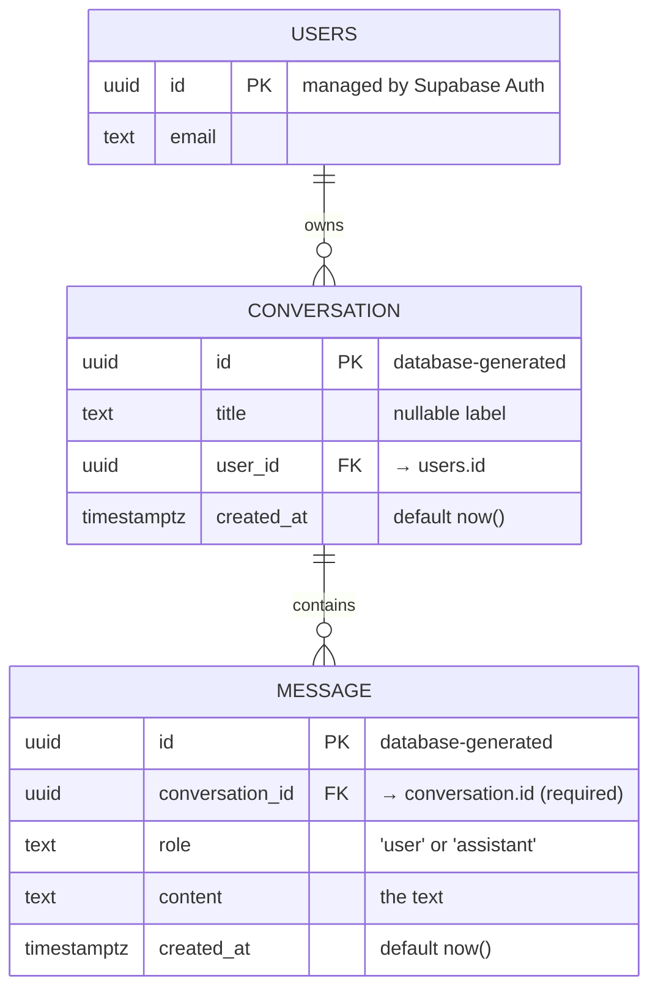

# Domain Model — The Workflow Diagnoser

Before we build a database, we draw the shape of the thing we want to remember.
This is the **domain model**: the nouns of our app, what we know about each one,
and how they connect. Last week these were sheets on paper. This week they
become tables in Postgres.

> The rule of the week: **model it before you store it.**

---

## 1. The story the model has to support

A person (Aarav) describes a repeated task. The AI replies with a diagnosis.
That single exchange — and every one after it — must survive the tab closing.

So we have to remember two kinds of things:

1. **A conversation** — one diagnosis session ("Aarav: first diagnosis").
2. **The messages inside it** — what the user said, and what the AI answered.

One conversation holds many messages. That "one holds many" is the whole game.

---

## 2. Entities and their attributes

An **entity** is a noun worth storing (it becomes a table). An **attribute** is
a fact we know about that noun (it becomes a column). Each attribute carries a
**type** — a promise about what kind of value is allowed. A spreadsheet can't
keep that promise; a database can.

### Entity: `conversation`

One diagnosis session.

| Attribute    | Type          | Promise / Constraint                          |
|--------------|---------------|-----------------------------------------------|
| `id`         | `uuid`        | Primary key. Invented by the database. Unique and permanent. |
| `title`      | `text`        | A short label (e.g. the first 60 chars). May be empty. |
| `user_id`    | `uuid`        | Who owns this conversation. Points at `auth.users(id)`. (Added in the Auth step.) |
| `created_at` | `timestamptz` | When it started. Defaults to `now()`.         |

### Entity: `message`

One line in a conversation — either from the user or the assistant.

| Attribute         | Type          | Promise / Constraint                                  |
|-------------------|---------------|-------------------------------------------------------|
| `id`              | `uuid`        | Primary key. Invented by the database.                |
| `conversation_id` | `uuid`        | **Foreign key** → `conversation(id)`. The thread that ties a message to its conversation. Required. |
| `role`            | `text`        | Must be `'user'` or `'assistant'` — nothing else.     |
| `content`         | `text`        | The actual text. Required.                            |
| `created_at`      | `timestamptz` | When it was written. Defaults to `now()`.             |

### Why is `id` a `uuid` the database invents, and not the title?

Because **identity must be meaningless and permanent.** Titles repeat and titles
change. An `id` that the database generates never collides and never needs to
change, so everything else can safely point at it.

---

## 3. Relationships

There is exactly one relationship, and it is the spine of the model:

```
conversation  1 ──────< *  message
              one         many
```

- **One** conversation **has many** messages.
- **Each** message **belongs to exactly one** conversation.

The link is the `conversation_id` column on `message`. In the database this link
gets a bouncer called a **foreign key** (`REFERENCES conversation(id)`):

> You cannot write a message that points at a conversation that does not exist.

That single rule is what stops "ghost messages" — orphaned rows pointing at
nothing. The spreadsheet would have accepted the ghost. Postgres refuses it.

Later we add a second relationship for ownership:

```
auth.users   1 ──────< *  conversation
   (a user)  one         many
```

One user owns many conversations. This is what lets us answer *"whose rows are
whose?"* — the question that motivates Auth and Row-Level Security.

---

## 4. ER diagram

An **Entity-Relationship (ER) diagram** is the picture of everything above. The
crow's-foot (`}o` / `||`) marks the "many" end and the "one" end.



If your viewer doesn't render Mermaid, read it as plain English:

```
  ┌──────────────┐         owns          ┌──────────────────┐      contains      ┌──────────────┐
  │  auth.users  │ 1 ───────────────< *  │   conversation   │ 1 ──────────────< * │   message    │
  ├──────────────┤                       ├──────────────────┤                     ├──────────────┤
  │ id (PK)      │                       │ id (PK)          │                     │ id (PK)      │
  │ email        │                       │ title            │                     │ conversation_id (FK) │
  └──────────────┘                       │ user_id (FK)─────┼──┐                  │ role         │
                                         │ created_at       │  │ points back to   │ content      │
                                         └──────────────────┘  │ auth.users.id    │ created_at   │
                                                               └──                └──────────────┘
```

---

## 5. From model to SQL (the cheat sheet)

Everything in this file maps one-to-one onto the SQL we write next. Nothing new
is invented at the database; we are just dictating the model we already drew.

| Domain word        | SQL word                                  |
|--------------------|-------------------------------------------|
| Entity / sheet     | `table`                                   |
| Attribute / column | `column`                                  |
| Type promise       | `uuid`, `text`, `timestamptz`             |
| Identity           | `primary key`                             |
| Relationship/thread| `references other_table(id)` (foreign key)|
| "must be one of …" | `check (role in ('user','assistant'))`    |

The next file, `db/01_schema.sql`, is this table turned into runnable SQL.
